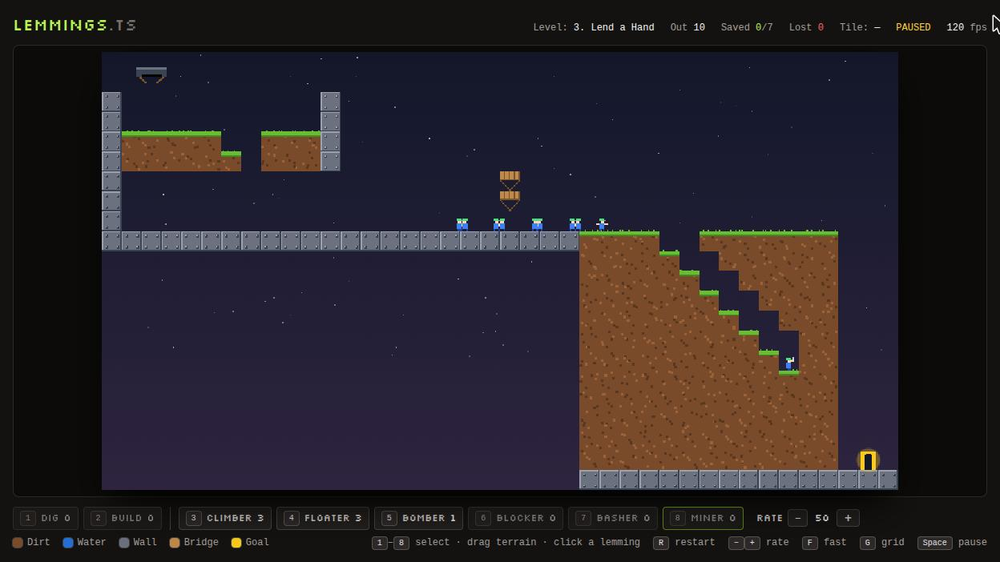

# Lemmings.ts

A lightweight Lemmings-style puzzle game in TypeScript and the HTML5 Canvas API, with no game engine, and a Tailwind CSS HUD.

Lemmings drop from a hatch and walk on their own. Shape the terrain in real time, and give individual lemmings jobs, so that enough of them reach the exit before they drown, splat, or fall into the void.

<p align="center">
  
</p>

## Running it

```bash
npm install
npm run dev        # http://localhost:5173
npm test           # Vitest: physics, state machine, tools, level solvability
npm run build      # typecheck + production build
```

## Controls

| Input | Action |
| --- | --- |
| Click and drag | With a terrain tool selected: use it on every tile you sweep over |
| Click a lemming | With a skill selected: give it that skill (the target is outlined green if it can take it) |
| `1` / `2` | Select terrain tool **Dig** (remove dirt or bridge) / **Build** (place a bridge in open air) |
| `3`–`8` | Select skill **Climber**, **Floater**, **Bomber**, **Blocker**, **Basher**, **Miner** |
| `−` / `+` | Slow down / speed up the release rate (1–99; hold to change quickly, or use the HUD buttons) |
| `Space` | Pause (you can still edit terrain, give skills and change the release rate while paused) |
| `K` | Nuke: press twice (or use the HUD button) to blow up every lemming and end a hopeless run |
| `F` | Fast-forward ×3 |
| `R` | Restart the level |
| `N` | Next level (after a win) |
| `G` | Toggle grid overlay |
| `L` | Open the level select (`Esc` or `L` closes it) |
| `E` | Open the level editor (`E` or `Esc` leaves it) |
| `H` | Open the How to play guide (`Esc` or Close returns to the previous screen) |

Each tool and skill has limited charges per level, shown in the toolbar.

## In-game guide

Choose **How to play** on the opening level select screen or in the top bar, or press `H` from the game, level select, or editor. The scrollable guide explains automatic lemming behavior, terrain tools, all six skills with assignment rules and practical examples, hazards, tactics, controls, progress, and the editor. Section links let you jump straight to a topic.

Gameplay freezes while the guide is open and its keyboard focus stays inside the panel. Closing it returns to the same screen and preserves your pause state.

## Sound

The hatch opening, successful digging (including the Dig tool, Basher, and Miner), and entering water play short Web Audio effects. Reaching the goal triggers a high-pitched spoken **“Yippie!”** using an available English browser speech voice, with a two-note celebration as the fallback when no voice is available or speech fails. Voices vary by browser.

Sound starts after a click or key press. **Sound on / off** in the top bar mutes all output and saves the preference in this browser. Pausing, opening the guide, level select or editor, restarting, and hiding the tab stop active sounds. No sounds are queued for later, and crowd effects are limited to avoid excessive overlap during fast-forward. Old progress saves default to sound enabled.

## Progress

The game opens on a level select screen. Levels unlock in order: the first is open, and solving a level unlocks the next. Each card shows whether the level is solved, your best saved count and fastest win, and how many attempts and wins you've had. The simulation is frozen while the level select is open.

Progress is saved in your browser's `localStorage`: the per-level records, the level you last played (the level select starts with it highlighted, so `Enter` resumes it), and your grid overlay and sound preferences. The HUD shows how many levels you've solved and your best on the current level. The end-of-level panel calls out a first clear or a new best. **reset progress** on the level select clears it all and locks every level but the first.

## Difficulty ramp

The first three levels stay untimed so you can learn the tools and skills. Levels 4–8 introduce deadlines, higher save targets, and tighter budgets:

| Level | Time limit | Save target | Tool and skill budget |
| --- | --- | --- | --- |
| 4. Turn Back | 1:30 | 8/10 | 1 Blocker |
| 5. Parachute Drop | 1:15 | 6/8 | 7 Build, 6 Floaters |
| 6. Over the Wall | 1:05 | 6/6 | 4 Build, 6 Climbers |
| 7. Down the Mine | 0:55 | 9/10 | 1 Miner |
| 8. Grand Tour | 1:00 | 8/8 | 1 Dig, 7 Build, 8 Climbers, 1 Basher |

The final level has a longer route, but less spare time. Every built-in level has a tested solution within its deadline at the default release rate.

The HUD shows the countdown and a **Hurry!** warning for the last ten seconds. It follows simulation time: pause, the guide, level select, and editor freeze it; fast-forward runs it at ×3. At zero, the attempt ends and the result screen explains the timeout. Restart gives you the full time allowance again. Existing campaign progress is preserved.

## Level editor

Press `E` (or the **Editor** button) to build your own level. The game is frozen while you edit, and going back resumes the attempt you left.

| Input | Action |
| --- | --- |
| `1`–`7` | Pick a brush: Empty, Dirt, Water, Wall, Bridge, Goal, or the spawn Hatch |
| `B` / `F` | Pencil (drag to paint; fast drags leave no gaps) / Fill (click to flood-fill a connected area) |
| `Ctrl`+`Z`, `Ctrl`+`Y` | Undo / redo map changes (`Cmd` on a Mac) |
| `P` | Playtest the level: it runs like the real game, but nothing is saved |
| `E` or `Esc` | Back to the game |
| **Share** | Copy a link that opens the level in anyone's game |

Below the map you can resize it, name the level, and set the lemming count, save target, time limit in seconds (0 means untimed, up to 3600), release rate, bricks, and tool and skill charges. **Start from…** copies a built-in level or a blank map. A level needs a name, a hatch and a goal, and a save target no bigger than the lemming count; the panel lists whatever is missing and keeps **Playtest** off until it's fixed.

Your work is saved in the browser as you go, so it is still there after a reload. **Export / import** shows the level as code in the style of `levels.ts`. Paste it into the `LEVELS` array to add it to the game (then add a solvability test, see `levels.test.ts`), or edit it there and load it back. Plain map rows work for import too. Custom levels don't appear in the level select and never touch saved progress.

### Sharing a level

**Share** (enabled once the level has a name, a hatch and a goal) copies a link like `https://…/#level=MXxUdXJu…`. The whole level is in the link, so there's no server: a typical level is a few hundred characters (the map is run-length encoded). Opening the link starts the level straight away under a **SHARED LEVEL** banner; like a playtest it saves nothing, `R` restarts it, and `L` goes back to the real levels. On its result panel, **Edit a copy** puts it in your editor (after asking, since it replaces your draft). A link pasted into **Export / import** loads the same way. If the clipboard is blocked, the link is shown in the export box to copy by hand.

Untimed links keep the original format. Timed links use version 2 so older clients reject them instead of silently removing the deadline; the current game reads both versions.

A link is just data from whoever made it, so it's checked before it's used: size limits on the link and on the map, unknown tiles and versions refused, numbers clamped, and a level without a hatch or goal rejected with a message.

## Skills

Terrain tools are a global budget you spend on tiles. Skills are a second budget you spend on one lemming at a time:

| Skill | Effect |
| --- | --- |
| **Climber** | Permanent. Climbs walls instead of turning around; lets go and falls back under an overhang. |
| **Floater** | Permanent. Opens an umbrella and survives any fall (but not the void). |
| **Bomber** | Counts down 5 seconds, then explodes, blasting diggable terrain within 1.5 tiles. Reaching the exit defuses it. |
| **Blocker** | Stands still and turns other walkers around. Remove its support to make it fall and resume moving, or bomb it to free its spot. |
| **Basher** | Tunnels horizontally through dirt and bridge, including one-tile steps a walker would jump. |
| **Miner** | Digs a staircase diagonally down and forward until it breaks through or hits a wall. |

Falls of more than 9 tiles are fatal. If only blockers are left, the level ends and they count as lost.

**Nuke** (`K`, pressed twice within 3 seconds) is for a run that has gone wrong: lemmings still in the hatch never come out and count as lost, and everyone in play gets the Bomber's 5-second fuse. Anyone who reaches the exit before it burns down is still saved, so a level you've already won on can finish early. It can't be undone, and a restart (`R`) is the way back.

## How lemmings behave

Each lemming runs a finite state machine (`src/entities/states/`):

| State | Behaviour |
| --- | --- |
| **Falling** | Gravity with terminal velocity; lands on the first solid tile top; lost if it drops off the bottom of the map. |
| **Walking** | Walks forward and falls off ledges. When blocked, it **jumps** a one-tile step, **digs** through dirt, **builds** if the obstacle is taller and it has bricks, or otherwise turns around. |
| **Jumping** | A ballistic arc that clears one tile, with wall and ceiling collision. |
| **Digging** | Spends `DIG_TIME` tunnelling through the dirt tile ahead. |
| **Building** | Lays a bridge block underfoot and climbs onto it, one brick per block. Stacks left behind become stairs for later lemmings. |
| **Swimming** | Floats at the surface and paddles. If it reaches a low bank it climbs out; otherwise it tires and drowns. |
| **Exiting** | Reached the goal, so it counts as saved. |
| **Splatting** | Landed from more than 9 tiles up without an umbrella, so it's lost. |
| **Climbing**, **Blocking**, **Bashing**, **Mining** | Jobs given by skills (see above). Walkers also climb instead of turning if they're climbers. |

A level ends when every lemming is saved or lost, or its time limit expires. You win if you saved at least the required number. At the deadline, lemmings already entering the exit count as saved; all others, including those still in the hatch, count as lost.

## Architecture

```
src/
├── config.ts             Tile size, timestep, and all physics/timing constants
├── core/                 GameLoop (fixed 60 Hz timestep), Game (sessions, input, outcome) and EditorMode
├── entities/             Lemming (data), Crowd (spawner + tally), World, and states/ (one file per FSM state)
├── tools/                Tool definitions, the combined tool + skill action list, and Toolbox (charges, drag strokes, skill assignment)
├── skills/               Skill definitions: who can take each skill and what it does
├── world/                Grid, TileType properties, ASCII level parser, and level data
├── render/               Canvas renderer, cached tile layer, tile and lemming pixel art
├── input/                Pointer and keyboard; drag samples are queued so fast strokes aren't missed
├── progress/             Saved progress (solved levels, bests, resume point, settings) over a pluggable key-value store
├── editor/               The level editor's DOM-free model: LevelDraft (painting, fill, resize, undo, export), level text parsing, draft storage, share links
└── ui/                   Tailwind HUD, the end-of-level overlay, level select and the editor panel
```

- **States are stateless singletons.** Per-lemming data lives on `Lemming`. Transitions go through a name-keyed registry, so state modules never import each other.
- **The simulation is DOM-free.** `Grid`, `Lemming`, `Crowd` and `Toolbox` run headless in Vitest. `levels.test.ts` plays each level with a known solution (terrain strokes and timed skill assignments) to prove it can be won.
- **Levels are ASCII maps** in `src/world/levels.ts`. The legend: `.` empty, `#` dirt, `X` wall, `~` water, `=` bridge, `G` goal, `S` spawn.
